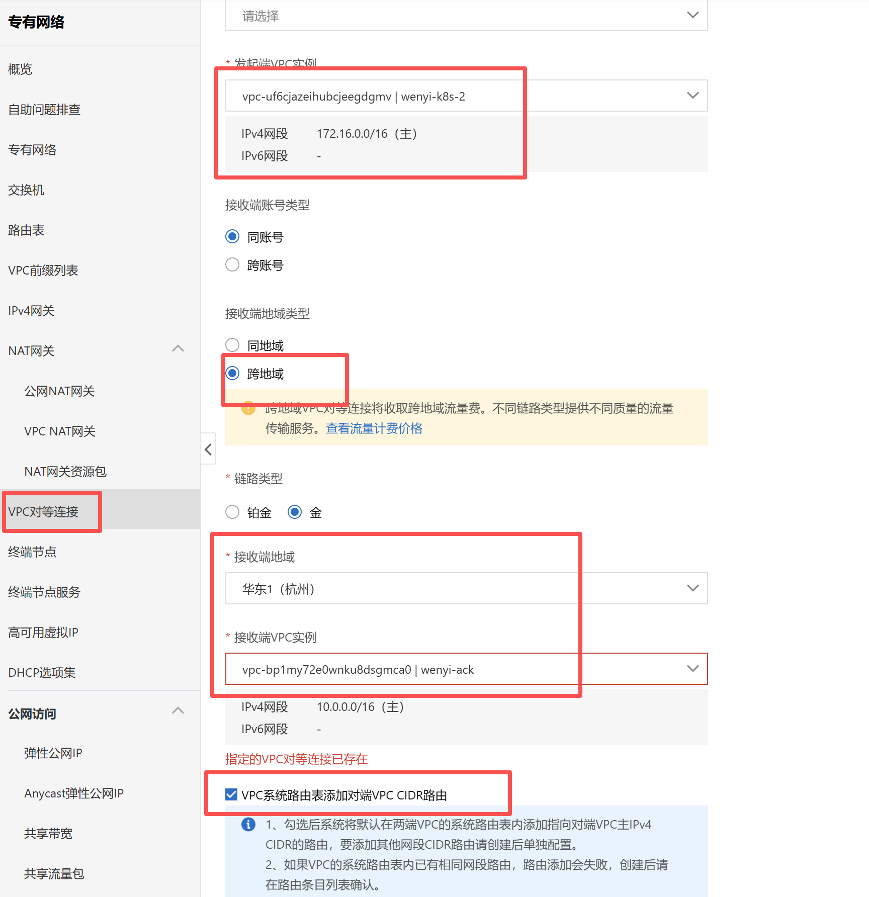
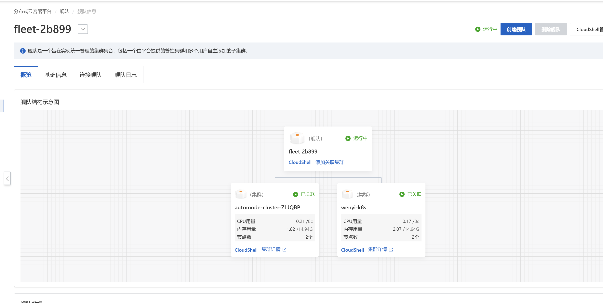
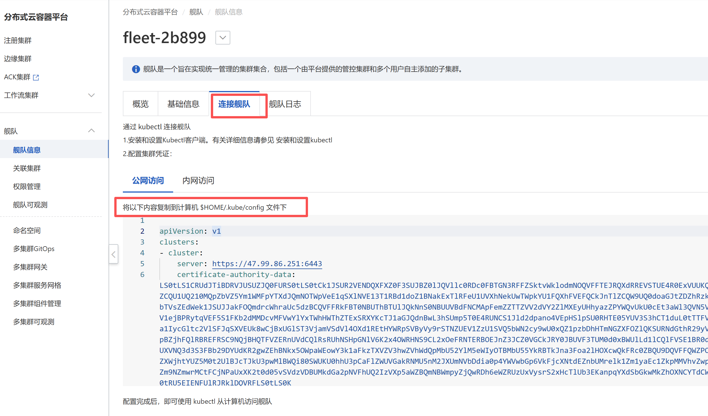

# ACK_ONE


| cluster                 | region   | vpc         |
| ----------------------- | -------- | ----------- |
| fleet-2b899（fleet）    | hangzhou | wenyi-ack   |
| wenyi-k8s               | hangzhou | wenyi-ack   |
| automode-cluster-ZLJQBP | shanghai | wenyi-k8s-2 |


1、因为fleet和其中一个cluster不在同一个vpc，所以需要创建对等互联。

> VPC系统路由表添加对端VPC CIDR路由。这个选项一定要选。





2、把两个cluster加到fleet里。




腾讯ECS安装kubectl：

[Install and Set Up kubectl on Linux | Kubernetes](https://v1-34.docs.kubernetes.io/docs/tasks/tools/install-kubectl-linux/#verify-kubectl-configuration)

```bash
sudo apt-get update
# apt-transport-https may be a dummy package; if so, you can skip that package
sudo apt-get install -y apt-transport-https ca-certificates curl gnupg

# If the folder `/etc/apt/keyrings` does not exist, it should be created before the curl command, read the note below.
# sudo mkdir -p -m 755 /etc/apt/keyrings
curl -fsSL https://pkgs.k8s.io/core:/stable:/v1.34/deb/Release.key | sudo gpg --dearmor -o /etc/apt/keyrings/kubernetes-apt-keyring.gpg
sudo chmod 644 /etc/apt/keyrings/kubernetes-apt-keyring.gpg # allow unprivileged APT programs to read this keyring


# This overwrites any existing configuration in /etc/apt/sources.list.d/kubernetes.list
echo 'deb [signed-by=/etc/apt/keyrings/kubernetes-apt-keyring.gpg] https://pkgs.k8s.io/core:/stable:/v1.34/deb/ /' | sudo tee /etc/apt/sources.list.d/kubernetes.list
sudo chmod 644 /etc/apt/sources.list.d/kubernetes.list   # helps tools such as command-not-found to work correctly


sudo apt-get update
sudo apt-get install -y kubectl
```


配置kubectl：

```bash
kubectl cluster-info

在root目录下，创建文件夹：
mkdir .kube
cd ./.kube
vi config
```

配置文件直接粘贴




连接成功

```bash
kubectl get ns -A
NAME                                STATUS   AGE
ack-cluster-gateway                 Active   3h32m
ack-multiple-clusters               Active   3h32m
argocd                              Active   3h31m
arms-prom                           Active   3h31m
c08f75a3678e24fda907369d17fbdcfa4   Active   125m
ca66b3baac4b148f7a854fc24ab5fe42e   Active   3h31m
default                             Active   3h33m
kube-node-lease                     Active   3h33m
kube-public                         Active   3h33m
kube-queue                          Active   3h31m
kube-system                         Active   3h33m
```


## 步骤一（可选）：在舰队实例中创建命名空间


```bash
kubectl create namespace demo
```


## **步骤二：在舰队实例中创建应用**

此处应用支持ConfigMap、Deployment、Service等资源，本文以分发单独一个Nginx Deployment为例介绍。

```bash
vi web-demo.yaml
```


```yaml
apiVersion: apps/v1
kind: Deployment
metadata:
  namespace: demo
  name: web-demo
spec:
  replicas: 3
  selector:
    matchLabels:
      app: web-demo
  template:
    metadata:
      labels:
        app: web-demo
    spec:
      containers:
      - name: nginx
        image: registry-cn-hangzhou.ack.aliyuncs.com/acs/web-demo:0.5.0
        ports:
        - containerPort: 80
```


部署应用

```bash
kubectl apply -f web-demo.yaml
```


## 步骤三：在舰队实例中创建分发策略为多集群分发应用

可以通过定义分发策略（PropagationPolicy）选择需要分发的应用以及对应的集群。创建分发策略后会将匹配到的应用分发到对应集群中。

本文示例：以复制（Duplicated）方式将Deployment weighted-deployment分发到Cluster1和Cluster2中，两集群副本数一致，均为3个。


获取舰队实例管理的子集群ID

```bash
kubectl get mcl

# 
kubectl get mcl
NAME                                HUB ACCEPTED   MANAGED CLUSTER URLS   JOINED   AVAILABLE   AGE
c08f75a3678e24fda907369d17fbdcfa4   true                                  True     True        126m
ca66b3baac4b148f7a854fc24ab5fe42e   true                                  True     True        3h32m
```


`ClusterPropagationPolicy`用于Cluster Scope资源的分发，`PropagationPolicy`用于Namespace Scope资源的分发。

```bash
vi propagationpolicy.yaml
```

```yaml
apiVersion: policy.one.alibabacloud.com/v1alpha1
kind: ClusterPropagationPolicy
metadata:
  name: web-demo
spec:
  resourceSelectors:
  - apiVersion: v1
    kind: Namespace
    name: demo
  placement:
    clusterAffinity:
      clusterNames:
      - ca66b3baac4b148f7a854fc24ab5fe42e # 您的集群id
      - c08f75a3678e24fda907369d17fbdcfa4 # 您的集群id
    replicaScheduling:
      replicaSchedulingType: Duplicated
---
apiVersion: policy.one.alibabacloud.com/v1alpha1
kind: PropagationPolicy
metadata:
  name: web-demo
  namespace: demo
spec:
  preserveResourcesOnDeletion: true     # 设置为true，删除舰队上资源时，子集群上资源会被保留。如需同时清理子集群资源，请设置为false。
  resourceSelectors:
  - apiVersion: apps/v1
    kind: Deployment
    name: web-demo
    namespace: demo
  placement:
    clusterAffinity:
      clusterNames:
      - ca66b3baac4b148f7a854fc24ab5fe42e # 您的集群id
      - c08f75a3678e24fda907369d17fbdcfa4 # 您的集群id
    replicaScheduling:
      replicaSchedulingType: Duplicated
```


```bash
kubectl apply -f propagationpolicy.yaml
```


## 步骤五：查看多集群中应用的状态


安装AMC命令

[AMC命令行工具的安装与使用-容器服务 Kubernetes 版 ACK-阿里云](https://help.aliyun.com/zh/ack/distributed-cloud-container-platform-for-kubernetes/user-guide/use-amc)

```bash
wget http://ack-one.oss-cn-hangzhou.aliyuncs.com/kubectl-amc-linux-amd64 && chmod +x kubectl-amc-linux-amd64 && mv kubectl-amc-linux-amd64 /usr/local/bin/kubectl-amc
```


```bash
kubectl amc get deploy -ndemo -M


NAME       CLUSTER          READY   UP-TO-DATE   AVAILABLE   AGE    ADOPTION
web-demo   cxxxxxxxxxxxxx   3/3     3            3           3d4h   Y
web-demo   cxxxxxxxxxxxxx   3/3     3            3           3d4h   Y
```


## 步骤六：升级修改应用

修改`web-demo.yaml`

```yaml
replicas: 5
```


```bash
kubectl apply -f web-demo.yaml

kubectl amc get deploy -ndemo -M

NAME       CLUSTER          READY   UP-TO-DATE   AVAILABLE   AGE    ADOPTION
web-demo   cxxxxxxxxxxxxx   5/5     5            5           3d4h   Y
web-demo   cxxxxxxxxxxxxx   5/5     5            5           3d4h   Y
```


## 步骤七：删除应用资源


修改`PropagationPolicy`中`preserveResourcesOnDeletion`字段为`false`

```yaml
preserveResourcesOnDeletion: false 
```


```bash
kubectl apply -f propagationpolicy.yaml

kubectl delete -f web-demo.yaml

kubectl amc get deploy -ndemo -M
```

预期输出：

```bash
cluster(cxxxxxxxxxxxxx): deployments.apps "web-demo" not found
cluster(cxxxxxxxxxxxxx): deployments.apps "web-demo" not found
```


