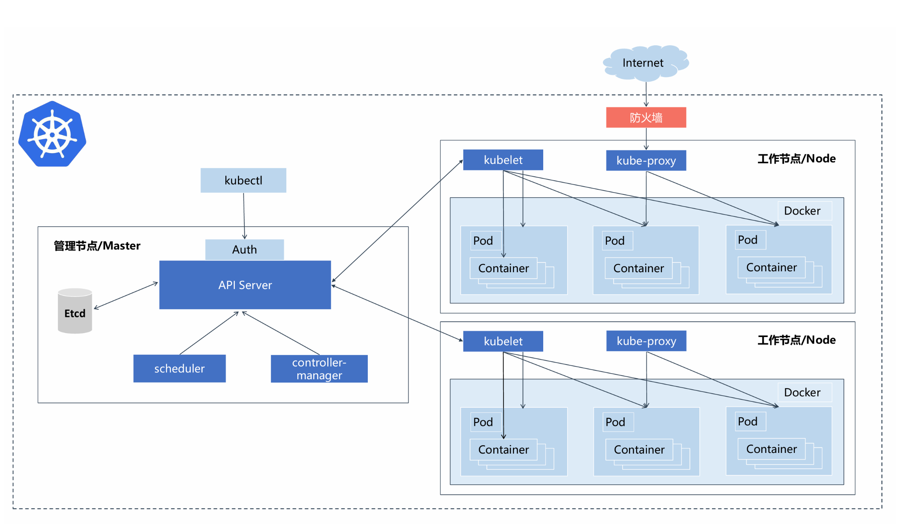

# K8S总结


# 1、概念和部署


### 什么是K8S

* **pods**: 是一组紧密关联的容器集合，它们共享IPC（进程间通信）、network（网络）和UTS namespace（UTS 命名空间是Linux命名空间的一个子系统，主要作用是完成对容器Hostname和Domain的隔离，同时保存内核名称、版本、以及底层体系结构类型等信息），是Kubernetes调度的基本单位。

* **labels**：键值对标签，可以被关联到如Pod这样的对象上，主要作用是给用户一个直观的感受，比如这个Pod是用来放置数据库的
* **GUI**：用户图像界面，可以是Web用户界面，比如使用kubernetes-dashboard组件，用户可以通过Dashboard在Kubernetes集群中部署容器化的应用，可以查看集群中应用的运行情况，同时也能够基于Dashboard创建或部署、任务、服务等Kubernetes的资源。通过部署向导，用户能够对部署进行扩缩容，进行滚动更新、启动Pod和部署新应用。当然，通过Dashboard也能够查看Kubernetes资源的状态
* **kubectl**：用于管理Kubernetes集群的命令行工具
* **kube-apiserver**：提供了资源操作的唯一入口，并提供认证、授权、访问控制、API注册和发现等机制。
* **Kubernetes Master**：Kubenetes集群主节点，主要由Kube-apiserver, kube-scheduler, kube-controller-manager, etcd四个模块组成。
* **Kubernetes Node**：集群子节点，主要有kubelet、kube-proxy、runtime三个模块组成
* **image Registry**：镜像仓库，比如Dockerhub。


### K8S Master

- **kube-apiserver：** 提供了资源操作的唯一入口，并提供认证、授权、访问控制、API 注册和发现等机制
- **kube-scheduler：** 负责资源的调度，按照预定的调度策略将 Pod 调度到相应的机器上
- **kube-controller-manager：** 负责维护集群的状态，比如故障检测、自动扩展、滚动更新等
- **etcd：** CoreOS 基于 Raft 开发的分布式 key-value 存储，可用于服务发现、共享配置以及一致性保障（如数据库选主、分布式锁等）


### K8S Node

- **runtime：** 负责镜像管理以及 Pod 和容器的真正运行（CRI，Container Runtime Interface），默认的容器运行时为 Docker，还支持 RKT 容器
- **kubelet：** 负责维持容器的生命周期，同时也负责 Volume（CVI，Container Volume Interface）和网络（CNI，Container Network Interface）的管理
- **kube-proxy：** 负责为 Service 提供 cluster 内部的服务发现和负载均衡





### K8S核心知识

1. pod
2. deployment
3. service
4. volume
5. pv
6. pvc
7. ingress
8. cni
9. configmap
10. dashboard


# 2、监控与日志

```bash
查看master组件状态：
kubectl get cs
查看node状态：
kubectl get node 
查看资源的详细：
kubectl describe <资源类型> <资源名称>
查看资源信息：
kubectl get <资源类型> <资源名称> # -o wide、-o yaml

查看Node资源消耗：
kubectl top node <node name>
查看Pod资源消耗：
kubectl top pod <pod name>
```

```bash
查看容器标准输出日志：
kubectl logs <Pod名称>
kubectl logs -f <Pod名称>
```


```bash
查看容器标准输出日志： 

kubectl logs <pod名称>
kubectl logs -f  <pod名称>
kubectl logs -f  -c <容器名称>

-c指的是container
```


# 3、控制器

## Deployment

```bash
# 1. Deployment
Deployment是工作负载控制器(workload controllers)，是抽象概念。（无状态应用，例如网站、API、微服务）.
```


主要功能：

- 管理pod和ReplicaSet
- 具有上线部署、副本设定、滚动升级、回滚等功能
- 提供声明式更新，例如只更新一个image


如果删掉一个pod，deployment会自动再拉起一个


（1）滚动升级

首先有一个1.14版本的nginx：

```bash
root@k8s-node1:/home/azureuser# docker images
REPOSITORY                     TAG       IMAGE ID       CREATED         SIZE

nginx                          1.14.2    295c7be07902   6 years ago     109MB
```


```bash
root@k8s-master:/home/azureuser# kubectl get deploy
NAME   READY   UP-TO-DATE   AVAILABLE   AGE
n-d    2/2     2            2           112m
```


有3种方式升级应用：

```bash
#1 kubectl apply -f <>.yaml，直接修改yaml
kubectl apply -f mydeploy-nginx.yaml

#2 kubectl set image deployment/<deloyment-name> <container-name>=nginx:1.16
wenyi_sun01@Azure:~/k8sfiles$ kubectl set image deployment/n-d nginx=nginx:1.16
deployment.apps/nginx image updated

root@k8s-node1:/home/azureuser# docker images
REPOSITORY                     TAG       IMAGE ID       CREATED         SIZE

nginx                          1.16      dfcfd8e9a5d3   5 years ago     127MB
nginx                          1.14.2    295c7be07902   6 years ago     109MB

root@k8s-master:/home/azureuser# kubectl get po
NAME                   READY   STATUS    RESTARTS   AGE
n-d-7f65fcf556-h98dl   1/1     Running   0          34s
n-d-7f65fcf556-xqqfl   1/1     Running   0          27s
root@k8s-master:/home/azureuser# kubectl describe pod n-d-7f65fcf556-h98dl
    Image:          nginx:1.16


#3 kubectl edit deploy <deployment>，把image改成1.17，这里看到pod被重新创建了。
root@k8s-master:/home/azureuser# kubectl edit deploy n-d
deployment.apps/n-d edited

root@k8s-master:/home/azureuser# kubectl get po
NAME                  READY   STATUS    RESTARTS   AGE
n-d-7456645bf-8mp67   1/1     Running   0          37s
n-d-7456645bf-vxqrw   1/1     Running   0          44s
root@k8s-master:/home/azureuser# kubectl describe pod n-d-7456645bf-8mp67
    Image:          nginx:1.17
```

<font color="red">每次修改deployment，都会create一个ReplicaSet。不过只有pod数量改变不会创建新的ReplicaSet</font>


（2）水平扩容

```bash
# kubectl scale deployment <<deloyment-name>> --replicas=10

kubectl scale deployment n-d --replicas=3

root@k8s-master:/home/azureuser# kubectl scale deployment n-d --replicas=3
deployment.apps/n-d scaled
root@k8s-master:/home/azureuser# kubectl get po
NAME                  READY   STATUS    RESTARTS   AGE
n-d-7456645bf-8mp67   1/1     Running   0          112s
n-d-7456645bf-k7fsg   1/1     Running   0          4s
n-d-7456645bf-vxqrw   1/1     Running   0          119s
```


（3）回滚

<font color="red">说白了，回滚就是在几个ReplicaSet之间切换。根据我的测试，回滚后pod数量不会变化</font>

```bash
# kubectl rollout history deploy <deloyment-name>
# 查看例上发布版本
root@k8s-master:/home/azureuser# kubectl rollout history deploy n-d
deployment.apps/n-d 
REVISION  CHANGE-CAUSE
1         <none>
2         <none>
3         <none>

root@k8s-master:/home/azureuser# kubectl get rs
NAME             DESIRED   CURRENT   READY   AGE
n-d-647677fc66   0         0         0       132m
n-d-7456645bf    3         3         3       17m
n-d-7f65fcf556   0         0         0       19m

------------------------------------------------------------------------------------

# kubectl rollout undo deploy n-d
# 回滚上一个版本
root@k8s-master:/home/azureuser# kubectl rollout undo deploy n-d
deployment.apps/n-d rolled back
root@k8s-master:/home/azureuser# kubectl get rs
NAME             DESIRED   CURRENT   READY   AGE
n-d-647677fc66   0         0         0       132m
n-d-7456645bf    0         0         0       17m
n-d-7f65fcf556   3         3         3       19m

# 这里我们可以看到nginx的image回到了1.16版本，如下面图一

------------------------------------------------------------------------------------

# kubectl rollout undo deploy n-d --to-revision=1
# 回滚历史指定版本
wenyi_sun01@Azure:~$ kubectl rollout undo deploy n-d --to-revision=1
deployment.apps/nginx-deployment rolled back

# 这里我们可以看到nginx的image回到了1.14.2版本，如下面图二
root@k8s-master:/home/azureuser# kubectl describe pod n-d-647677fc66-bvsnd
    Image:          nginx:1.14.2
```


关于rollout里的<font color="red">CHANGE-CAUSE</font>，可以加上<font color="red">--record</font>，然后就会显示。

```bash
root@k8s-master:/home/azureuser# kubectl set image deployment/n-d nginx=nginx:1.16 --record
Flag --record has been deprecated, --record will be removed in the future
deployment.apps/n-d image updated

root@k8s-master:/home/azureuser# kubectl rollout history deploy n-d
deployment.apps/n-d 
REVISION  CHANGE-CAUSE
3         <none>
5         <none>
6         kubectl set image deployment/n-d nginx=nginx:1.16 --record=true

root@k8s-master:/home/azureuser# kubectl get rs
NAME             DESIRED   CURRENT   READY   AGE
n-d-647677fc66   0         0         0       139m
n-d-7456645bf    0         0         0       23m
n-d-7f65fcf556   3         3         3       26m
```


### 3.1.2 ReplicasSet

**ReplicaSet：**副本集，主要维护Pod副本数量，不断对比当前Pod数量 与期望Pod数量。 

**ReplicaSet用途：**Deployment每次发布都会创建一个RS作为记录， 用于实现滚动升级和回滚。


Deployment 是一个更高级的概念，它管理 ReplicaSet，并向 Pod 提供声明式的更新以及许多其他有用的功能。 因此，我们建议使用 Deployment 而不是直接使用 ReplicaSet， 除非你需要自定义更新业务流程或根本不需要更新。

- DESIRED: yaml里规定的pod数量
- CURRENT: 正在Running的pod数量
- READY: Ready的pod数量

```bash
wenyi_sun01@Azure:~$ kubectl get rs
NAME                          DESIRED   CURRENT   READY   AGE
mysql-7fc6f84c7b              1         1         1       2d23h
nginx-deployment-5c45c95f9d   0         0         0       20m
nginx-deployment-7d84685c59   3         3         3       18s
nginx-deployment-7f9d97d7cc   0         0         0       8d
```


只是扩容的话，不会增加replicaSet：

```bash
wenyi_sun01@Azure:~/k8sfiles$ kubectl get rs
NAME               DESIRED   CURRENT   READY   AGE
nginx-687df4c45    1         1         1       33s
nginx-6c84f6d98c   0         0         0       3m49s
nginx-7f597d689d   0         0         0       97s
wenyi_sun01@Azure:~/k8sfiles$ kubectl scale deploy nginx --replicas=3
deployment.apps/nginx scaled
wenyi_sun01@Azure:~/k8sfiles$ kubectl get rs
NAME               DESIRED   CURRENT   READY   AGE
nginx-687df4c45    3         3         3       2m20s
nginx-6c84f6d98c   0         0         0       5m36s
nginx-7f597d689d   0         0         0       3m24s
```


<font color="red">可以在rs里看到对应的版本号</font>

```bash
wenyi_sun01@Azure:~$ kubectl describe rs nginx-deployment-5c45c9 | grep -i REVISION
                deployment.kubernetes.io/revision: 4
                deployment.kubernetes.io/revision-history: 2
```


### 3.1.3 Pod

https://kubernetes.io/docs/concepts/workloads/pods/

Pod是一个逻辑抽象概念，Kubernetes创建和管理的最小单元， 一个Pod由一个容器或多个容器组成。

Pod特点： 

• 一个Pod可以理解为是一个应用实例，提供服务 

• Pod中容器始终部署在一个Node上 

• Pod中容器共享网络、存储资源


Pod主要用法： 

**• 运行单个容器：**最常见的用法，在这种情况下，可以将Pod看做是单 个容器的抽象封装 

• **运行多个容器：**边车模式（Sidecar），通过在Pod中定义专门容器， 来执行主业务容器需要的辅助工作，这样好处是将辅助功能同主业务 容器解耦，实现独立发布和能力重用。 例如： 日志收集/应用监控


一个pod可以有多个container：

```yaml
apiVersion: v1
kind: Pod
metadata:
  name: mypod1
  labels:
    app: nginx
spec:
  containers:
  - image: busybox
    name: bs-xya
    command: ["/bin/sh","-c","sleep 3600000"]
  - name: nginx-wb
    image: nginx:1.14.2
```


```bash
wenyi_sun01@Azure:~/k8sfiles$ kubectl apply -f mypod.yaml 
pod/mypod1 created
wenyi_sun01@Azure:~/k8sfiles$ kubectl get po
NAME                                READY   STATUS      RESTARTS   AGE
mypod1                              2/2     Running     0          6s
```


deployment也一样：

```yaml
apiVersion: apps/v1
kind: Deployment
metadata:
  name: multi-container
  labels:
    app: nginxa
spec:
  replicas: 1
  selector:
    matchLabels:
      app: nginxa
  template:
    metadata:
      labels:
        app: nginxa
    spec:
      containers:
      - image: busybox
        name: bs-xya
        command: ["/bin/sh","-c","sleep 3600000"]
      - name: nginx-wb
        image: nginx:1.14.2
```


```bash
wenyi_sun01@Azure:~/k8sfiles$ kubectl apply -f twocontainerindeploy.yaml 
deployment.apps/multi-container created
wenyi_sun01@Azure:~/k8sfiles$ kubectl get po
NAME                                READY   STATUS      RESTARTS   AGE
multi-container-566f7c7df7-j9rg6    2/2     Running     0          5s
```


### 3.1.4 InitContainer

在container运行之前运行的container，运行完成之后container才开始运行


Init Container：用于初始化工作，**执行完就结束**，可以理解为一次性任务。

* 支持大部分应用容器配置，但不支持健康检查
* 优先应用容器执行

应用场景：

* 环境检查：例如确保应用容器依赖的服务启动后再启动应用容器
* 初始化配置：例如给应用容器准备配置文件

实例：部署一个web网站，网站程序没有打到镜像中，而是希望从代码仓库中动态拉取放到应用容器中


因此，Pod中会有这几种类型的容器：

* Infrastructure Container：基础容器。维护整个Pod网络空间
* InitContainer：初始化容器。先于业务容器开始执行
* Container：业务容器。并行启动


```yaml
apiVersion: v1
kind: Pod
metadata:
  name: myapp-pod
  labels:
    app: myapp
spec:
  containers:
  - name: myapp-container
    image: busybox:1.28
    command: ['sh', '-c', 'echo The app is running! && sleep 3600']
  initContainers:
  - name: init-myservice
    image: busybox:1.28
    command: ['sh', '-c', "until nslookup myservice.$(cat /var/run/secrets/kubernetes.io/serviceaccount/namespace).svc.cluster.local; do echo waiting for myservice; sleep 2; done"]
  - name: init-mydb
    image: busybox:1.28
    command: ['sh', '-c', "until nslookup mydb.$(cat /var/run/secrets/kubernetes.io/serviceaccount/namespace).svc.cluster.local; do echo waiting for mydb; sleep 2; done"]
```


```bash
wenyi_sun01@Azure:~$ kubectl apply -f https://abcdefe.blob.core.windows.net/k8s/initcontainer.yml
pod/myapp-pod created

wenyi_sun01@Azure:~$ kubectl get pods
NAME                                READY   STATUS      RESTARTS   AGE
myapp-pod                           0/1     Init:0/2    0          2m27s
```


```bash
# 2个initcontainer都在等待service的创建，所以两个initcontainer都是waiting的状态
wenyi_sun01@Azure:~$ kubectl describe -f https://abcdefe.blob.core.windows.net/k8s/initcontainer.yml
.........省略内容.........
Events:
  Type    Reason     Age    From               Message
  ----    ------     ----   ----               -------
  Normal  Scheduled  3m47s  default-scheduler  Successfully assigned default/myapp-pod to aks-agentpool-37128677-vmss00000l
  Normal  Pulled     3m47s  kubelet            Container image "busybox:1.28" already present on machine
  Normal  Created    3m47s  kubelet            Created container init-myservice
  Normal  Started    3m47s  kubelet            Started container init-myservice
```


```bash
# 可以看container的log
wenyi_sun01@Azure:~$ kubectl logs myapp-pod -c init-myservice
Server:    10.0.0.10
Address 1: 10.0.0.10 kube-dns.kube-system.svc.cluster.local

waiting for myservice
nslookup: can't resolve 'myservice.default.svc.cluster.local'
nslookup: can't resolve 'myservice.default.svc.cluster.local'
Server:    10.0.0.10
Address 1: 10.0.0.10 kube-dns.kube-system.svc.cluster.local
```


At this point, those init containers will be waiting to discover Services named `mydb` and `myservice`.

Here's a configuration you can use to make those Services appear:


myservice.yml: 

```yaml
apiVersion: v1
kind: Service
metadata:
  name: myservice
spec:
  ports:
  - protocol: TCP
    port: 80
    targetPort: 9376
---
apiVersion: v1
kind: Service
metadata:
  name: mydb
spec:
  ports:
  - protocol: TCP
    port: 80
    targetPort: 9377
```


```bash
# 创建service
wenyi_sun01@Azure:~$ kubectl apply -f myservice.yaml 
service/myservice created
service/mydb created
```


```bash
wenyi_sun01@Azure:~$ kubectl get pod
NAME                                READY   STATUS            RESTARTS   AGE
myapp-pod                           0/1     PodInitializing   0          31m


wenyi_sun01@Azure:~$ kubectl get pod
NAME                                READY   STATUS      RESTARTS   AGE
myapp-pod                           1/1     Running     0          32m
```


Each init container must exit successfully before the next container starts. If a container fails to start due to the runtime or exits with failure, it is retried according to the Pod `restartPolicy`. However, if the Pod `restartPolicy` is set to Always, the init containers use `restartPolicy` OnFailure.


A Pod cannot be `Ready` until all init containers have succeeded. The ports on an init container are not aggregated under a Service. A Pod that is initializing is in the `Pending` state but should have a condition `Initialized` set to false.

If the Pod [restarts](https://kubernetes.io/docs/concepts/workloads/pods/init-containers/#pod-restart-reasons), or is restarted, all init containers must execute again.


因此，Pod中会有这几种类型的容器： 

• Infrastructure Container：基础容器 

维护整个Pod网络空间 

• InitContainers：初始化容器

先于业务容器开始执行 

• Containers：业务容器

并行启动


### 3.1.5 静态Pod

静态Pod特点：

* Pod 由特定节点上的kubelet管理
* 不能使用控制器
* Pod名称标识当前节点名称


在kubelet配置文件启动静态Pod：

vi /var/lib/kubelet/config.yaml

...

staticPodPath: /etc/kubernetes/manifests

...

将部署的pod yaml放到该目录会由kubelet自动创建


## DaemonSet

DaemonSet功能：

* 在每一个Node上运行一个Pod
* 新加入的node也同样会自动运行一个pod

应用场景：网络插件（calico），监控agent，日志agent。

部署方式和deployment一样，kind换成daemonset

```yaml
apiVersion: apps/v1
# kind换成DaemonSet
kind: DaemonSet
metadata:
  name: filebeat
  namespace: kube-system
spec:
  # 也没有Replicas
  selector:
    matchLabels:
      name: filebeat
  template:
    metadata:
      labels:
        name: filebeat
    spec:
      containers:
      - name: log
        image: elastic/filebeat:7.3.2
```


## StatefulSet

**Deployment**控制器设计原则：<font color="red">管理的所有Pod一模一样，提供同一个服务，也不考虑在哪台Node运行，可随意扩容和缩容</font>。这种应用称为“**无状态**”，例如Web服务

在实际的场景中，这并不能满足所有应用，尤其是分布式应用，会部署多个实例，这些实例之间往往有依赖关系，例如主从关系、主备关系，这种应用称为“有状态”，例如<font color="red">MySQL主从、 Etcd集群</font>


# 4、调度

都是决定pod部署在哪个node上。


<font color='red'>nodeSelector、nodeAffinity、Taints、Tolerations、nodeName在yaml file和container平级</font>

<font color='red'>nodeSelector：用于将pod调度到匹配label的node上</font>

nodeAffinity：

<font color='red'>重点：Taint的理解——比如node1有taint gpu=yes，意味着所有没有设置容忍gpu-yes的pod都无法创建到node1节点上。</font>


## 资源限制

容器资源限制：

* resources.limits.cpu
* resources.limits.memory

容器使用的最小资源需求，作为容器调度时资源分配的依据

* resources.requests.cpu
* resources.requests.memory


```yaml
      containers:
      - image: nginx:1.14.2
        name: nginx
        ports:
        - containerPort: 80
        resources:
          requests:
            memory: "128Mi"
            cpu: "100m"
          limits:
            memory: "256Mi"
            cpu: "200m"
```


## nodeSelector & nodeAffinity

nodeSelector和container 在yaml file里平级

nodeSelector：用于将**pod**调度到匹配label的node上，如果没有匹配的标签会调度失败。


```bash
root@k8s-master:/home/azureuser# kubectl label nodes k8s-master disktype=ssd
node/k8s-master labeled
```


```yaml
apiVersion: v1
kind: Pod
metadata: 
  labels:
    run: nginx
  name: pod-example
spec: 
  nodeSelector:
    disktype: "ssd"
  containers:
  - name: nginx
    image: nginx
```


nodeAffinity和container 在yaml file里平级

**nodeAffinity**： 节点亲和类似于nodeSelector，可以根据节点上的标签来约束Pod可以调度到哪些节点

相比nodeSelector：
• 匹配有更多的逻辑组合，不只是字符串的完全相等
• 调度分为软策略和硬策略，而不是硬性要求
• 硬（required）：必须满足
• 软（preferred）：尝试满足，但不保证
操作符： In、 NotIn、 Exists、 DoesNotExist、 Gt、 Lt  

```yaml
apiVersion: v1
kind: Pod
metadata:
  name: with-node-affinity
spec:
  affinity:
    nodeAffinity:
      #required和preferred选择一个
      requiredDuringSchedulingIgnoredDuringExecution:
        nodeSelectorTerms:
        - matchExpressions:
          - key: gpu
            operator: In
            values:
            - nvidia-tesla
      preferredDuringSchedulingIgnoredDuringExecution:
      - weight: 1
        preference:
          matchExpressions:
          - key: gpu
            operator: In
            values:
            - "yes"
  containers:
  - name: web
    image: nginx
```

**当使用nodeselector或者nodeAffinity没有节点带有声明的标签，那么会出现：pod不给分配，此时在给节点加上标签，pod就会重新评估分配到节点。**

**nodeAffinity如果选的是preferred。如果不符合，也会成功分配.**


## Taints & Tolerations

<font color='red'>Taints & Tolerations 依然在yaml file和container平级</font>


Taints： 避免Pod调度到特定Node上（和前面nodeSelector相反）

<font color='red'>重点：Taint的理解——比如node1有taint gpu=yes，意味着所有没有设置容忍gpu-yes的pod都无法创建到node1节点上。</font>

设置污点：

```bash
kubectl taint node [node] key=value:[effect]
```

其中[effect] 可取值：

* NoSchedule ：一定不能被调度。
* PreferNoSchedule：尽量不要调度。
* NoExecute：不仅不会调度，还会驱逐Node上已有的Pod。


```bash
# 给node加上taint
kubectl taint node k8s-node2 gpu=yes:NoSchedule

# 给nod去掉污点 (后面有个减号-)：
kubectl taint node k8s-node2 gpu=yes:NoSchedule-
```


Tolerations (污点容忍)

允许Pod调度到持有污点的node上。

```yaml
apiVersion: v1
kind: Pod
metadata:
  name: pod-taints
spec:
  containers:
  - name: pod-taints
    image: busybox:latest
  tolerations:
  # gpu=yes:NoSchedule
  - key: "gpu"
    operator: "Equal"
    value: "yes"
    effect: "NoSchedule“
```


## nodeName

nodeName和container 在yaml file里平级

指定node名称，将pod调度到指定的node上，不经过调度器

```bash
apiVersion: v1
kind: Pod
metadata:
  name: pod-example
  labels:
    app: nginx
spec:
  nodeName: k8s-node2 # 指定node，即使node有污点也能分配过去，因为不经过调度器
  containers:
  - name: nginx
    image: nginx:1.15
```


# 5、网络


## Service 控制器 

Service引入主要是解决Pod的动态变化，提供统一访问入口： 

• 防止Pod失联，找到提供同一个服务的Pod**（服务发现）** 

• 定义一组Pod的访问策略**（负载均衡）**


Pod与Service的关系：

• Service通过标签关联一组Pod 

• Service为一组Pod提供负载均衡能力


```bash
# ClusterIP			默认，集群内部使用（Pod），分配一个稳定的IP地址，即VIP，只能在集群内部访问
# NodePort  		对外暴露应用（浏览器）
# LoadBalancer		对外暴露应用，适用公有云
```

(1) 

NodePort: 在<font color='red'>每个节点</font>上启用一个端口来暴露服务，可以在集群外部访问。也会分配一个稳定内部集群IP地址。 

访问地址：<任意NodeIP>:<NodePort>

端口范围：30000-32767


NodePort：会在每台Node上监听端口接收用户流量，在实际情况下，对用户暴露的只会有一个IP和端口，那这么多台Node该使用哪台让用户访问呢？ 这时就需要前面加一个公网负载均衡器为项目提供统一访问入口了。


(2)

LoadBalancer：与NodePort类似，在<font color='red'>每个节点</font>上启用一个端口来暴露服务。除此之外，Kubernetes会请求底层云平台（例如阿里云、腾讯云、AWS等）上的负载均衡器，将每个Node（[NodeIP]:[NodePort]）作为后端添加进去。


**多端口Service定义：**对于某些服务，需要公开多个端口， Service也需要配置多个端口定义，通过端口名称区分。

<font color='red'>端口一定要有name</font>

```yaml
apiVersion: v1
kind: Service
metadata:
  name: web
spec:
  selector:
    app: web
  type: ClusterIP
  ports:
  - name: http
    port: 80 
    protocol: TCP
    targetPort: 80
  - name: https
    port: 443      
    protocol: TCP  
    targetPort: 443
```


Service的底层实现主要有iptables和ipvs二种网络模式，决定了如何转发流量。

kube-proxy的mode是iptables


## Ingress 对象（对外暴露应用）

七层（应用层）：基于协议转发，如http，可以实现基于域名、URL、Cookie的转发。例如nginx (http)


Ingress为弥补NodePort不足而生，NodePort存在的不足： 

• 一个端口只能一个服务使用，端口需提前规划 

• 只支持4层负载均衡


一般负载均衡器所说的四层和七层怎么讲？

四层（传输层）：基于IP和端口进行转发，例如：lvs，nginx (stream)

七层（应用层）：基于协议转发，如http，可以实现基于域名、URL、Cookie的转发。例如nginx (http)


```yaml
apiVersion: networking.k8s.io/v1
kind: Ingress
metadata:
  name: hello-world-ingress
  annotations:
    nginx.ingress.kubernetes.io/ssl-redirect: "false"
    nginx.ingress.kubernetes.io/use-regex: "true"
    nginx.ingress.kubernetes.io/rewrite-target: /$2
spec:
  ingressClassName: nginx
  rules:
  - http:
      paths:
      - path: /hello-world-one(/|$)(.*)
        pathType: Prefix
        backend:
          service:
            name: aks-helloworld-one
            port:
              number: 80
      - path: /hello-world-two(/|$)(.*)
        pathType: Prefix
        backend:
          service:
            name: aks-helloworld-two
            port:
              number: 80
      - path: /(.*)
        pathType: Prefix
        backend:
          service:
            name: aks-helloworld-one
            port:
              number: 80
---
apiVersion: networking.k8s.io/v1
kind: Ingress
metadata:
  name: hello-world-ingress-static
  annotations:
    nginx.ingress.kubernetes.io/ssl-redirect: "false"
    nginx.ingress.kubernetes.io/rewrite-target: /static/$2
spec:
  ingressClassName: nginx
  rules:
  - http:
      paths:
      - path: /static(/|$)(.*)
        pathType: Prefix
        backend:
          service:
            name: aks-helloworld-one
            port: 
              number: 80
```


# 6、存储


集群管理员会创建一系列的 PV。这些 PV 包含了为集群用户提供的真实存储资源，它们可利用 Kubernetes API 来消费。

Master 会监听 PVC 的产生，并尝试根据请求内容查找匹配的 PV，并把 PV 和 PVC 进行绑定。用户能够获取满足需要的资源，并且在使用过程中可能超出请求数量。如果找不到合适的卷，这一申请就会持续处于非绑定状态，一直到出现合适的 PV。


# 7、


# 8、


